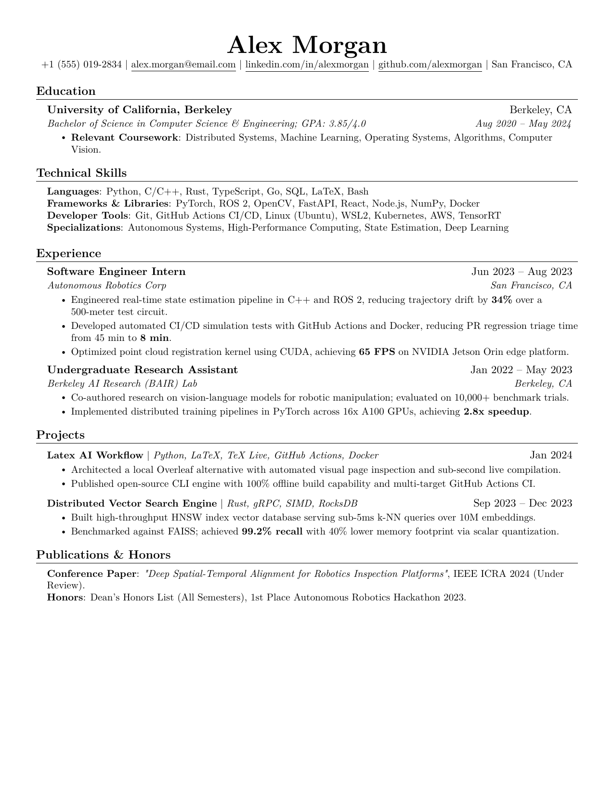
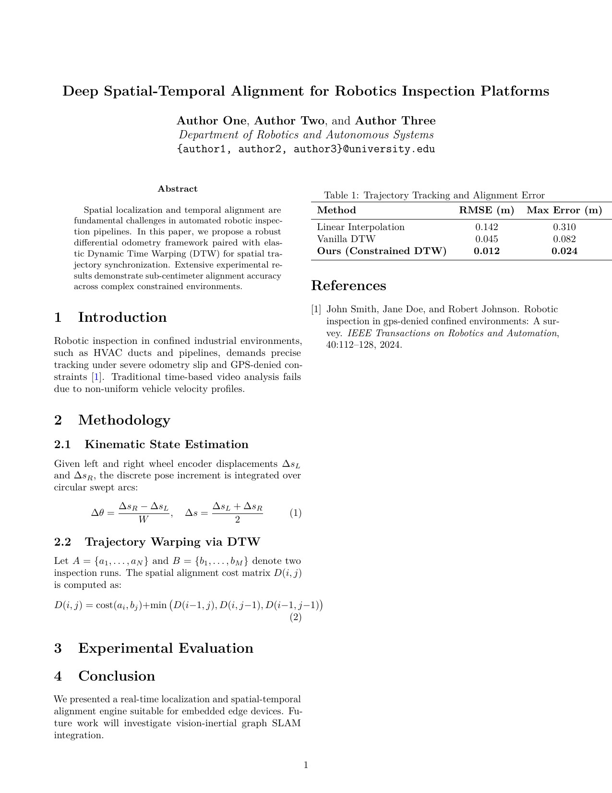
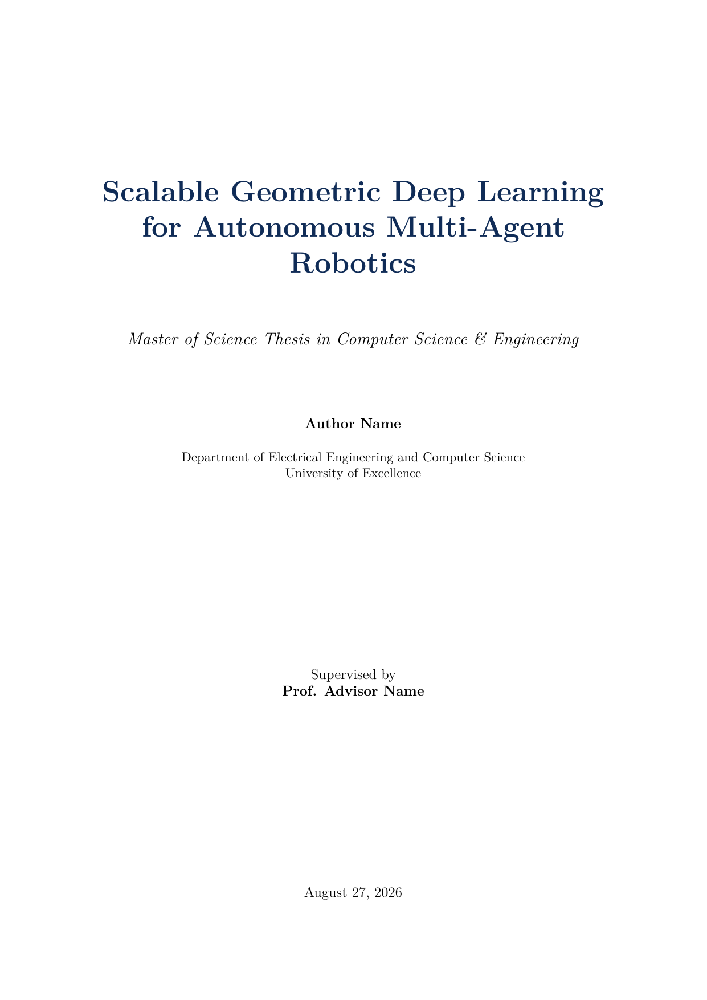
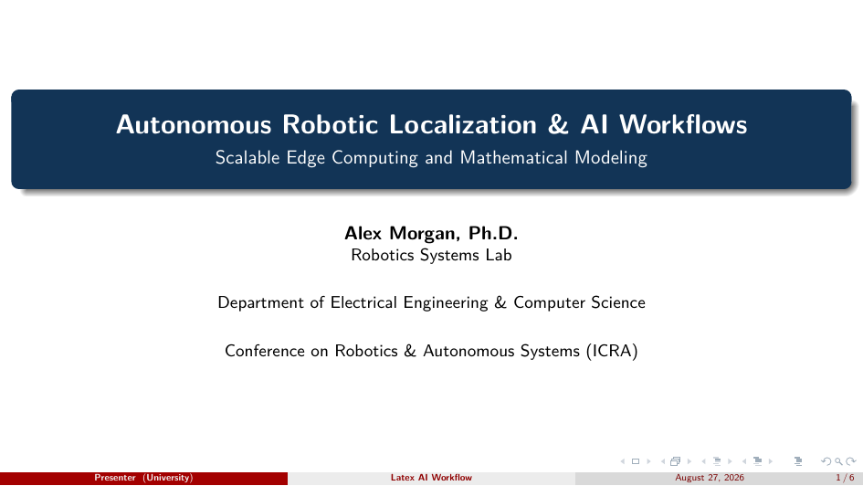
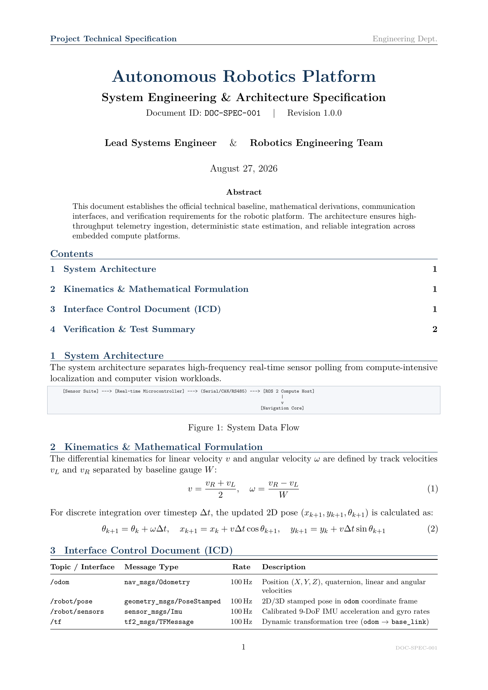
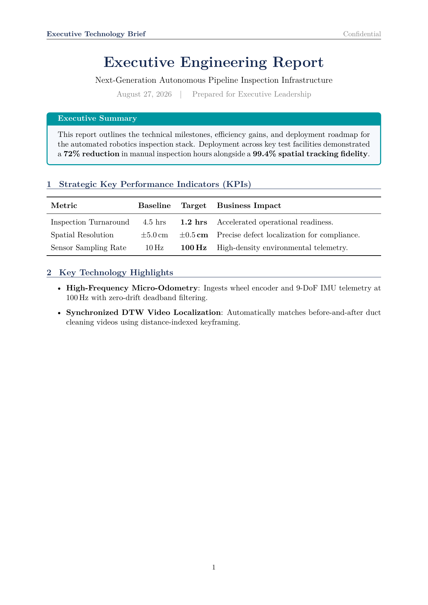
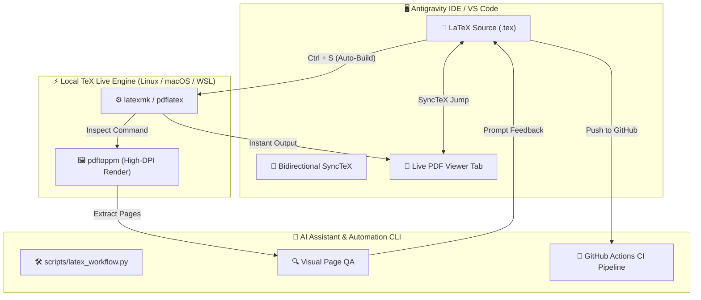

<div align="center">

# 🚀 Latex AI Workflow
### Universal, AI-Augmented, Publication-Grade LaTeX Framework & CLI Engine
**An Overleaf-Equivalent Local LaTeX Stack for Resumes, Academic Papers, Theses, Slides & Technical Docs**

[](CHANGELOG.md)
[](https://github.com/Divyansh0730/Latex-AI-Workflow/actions/workflows/compile-latex.yml)
[](LICENSE)
[](https://www.tug.org/texlive/)
[](https://github.com/Divyansh0730/Latex-AI-Workflow)
[](CONTRIBUTING.md)
[](.devcontainer/devcontainer.json)
[](https://python.org)

<p align="center">
  <a href="#-universal-quick-start">⚡ Quick Start</a> •
  <a href="#-template-showcase-gallery">🎨 Template Gallery</a> •
  <a href="#-master-cli-engine">🛠️ CLI Engine</a> •
  <a href="#-in-editor-workflow--shortcuts">🖥️ Editor Guide</a> •
  <a href="#-ai-prompt-playbook">🤖 AI Playbook</a> •
  <a href="#-overleaf-vs-latex-ai-workflow">📊 Comparison</a> •
  <a href="CHANGELOG.md">📜 Changelog</a>
</p>

</div>

---

## 💡 Why Latex AI Workflow?

Whether you are a **software engineer formatting an ATS-friendly resume**, a **researcher writing an IEEE/ACM paper**, a **student drafting a Master/PhD thesis**, or an **engineer publishing technical specifications**, traditional cloud LaTeX tools like Overleaf have severe limitations:
- ⏳ Server queue compilation timeouts on large documents and books.
- 💳 Paid subscriptions required for GitHub sync, full history, and offline mode.
- 🔒 Privacy concerns when drafting sensitive documents or proprietary code.
- 🤖 Lack of automated visual layout debugging with AI.

**Latex AI Workflow** provides a **100% free, offline, and cross-platform framework** that pairs the official TeX Live engine with instant live preview, automated visual page auditing, CI/CD verification, and turn-key templates for the entire document world.

---

## ⚡ Universal Quick Start

Get up and running in seconds on **Linux, macOS, Windows (WSL2 / Native), Termux, or GitHub Codespaces**:

### 🌟 Option 1: 1-Line Universal Setup (Recommended)
```bash
# Clone the repository
git clone https://github.com/Divyansh0730/Latex-AI-Workflow.git
cd Latex-AI-Workflow

# Run the universal cross-platform installer & environment doctor
chmod +x scripts/setup.sh && ./scripts/setup.sh
```

### 📦 Option 2: Python CLI Package Installation
Install `latex-workflow` as a global command in your environment:
```bash
pip install -e .
latex-workflow doctor
```

### ☁️ Option 3: 1-Click GitHub Codespaces / DevContainer (Zero Local Setup)
1. Click **Code $\to$ Codespaces $\to$ Create codespace on main**.
2. Everything (TeX Live, fonts, extensions, utilities) installs automatically within seconds.

---

## 🎨 Template Showcase Gallery

Explore production-ready, pre-styled templates designed for real-world document needs:

| Template | Preview | Use Case & Scaffolding |
| :--- | :---: | :--- |
| **Modern ATS Resume**<br/>`templates/modern_resume/` |  | **1-Page ATS-Optimized Tech & Software Resume** (Jake's Resume style). Clean typography, bulleted impact metrics, and high information density.<br/><br/>`latex-workflow init modern_resume my_resume` |
| **Academic Research Paper**<br/>`templates/academic_paper/` |  | **IEEE / ACM / arXiv 2-Column Paper** with BibTeX citation engine (`references.bib`), mathematical proofs, theorem boxes, and responsive tables.<br/><br/>`latex-workflow init academic_paper my_paper` |
| **Academic Thesis / Book**<br/>`templates/academic_thesis/` |  | **Master / PhD Dissertation & Thesis Book** with title page, abstract, table of contents, list of figures, lemma environments, and chapter styling.<br/><br/>`latex-workflow init academic_thesis my_thesis` |
| **Conference Slides (Beamer)**<br/>`templates/beamer_presentation/` |  | **Modern 16:9 Presentation Deck** for conference talks, lecture slides, and technical presentations with columns and code blocks.<br/><br/>`latex-workflow init beamer_presentation my_slides` |
| **Technical Specification**<br/>`templates/technical_specification/` |  | **Industrial & Software Engineering RFCs / Specs**, Interface Control Documents (ICDs), telemetry tables, and code syntax listings.<br/><br/>`latex-workflow init technical_specification my_spec` |
| **Executive Report**<br/>`templates/executive_report/` |  | **Corporate Whitepapers & Proposals** with styled callout boxes, KPI metric tracking, and modern executive headers.<br/><br/>`latex-workflow init executive_report my_report` |

---

## 🖥️ In-Editor Workflow & Keyboard Shortcuts

Open the repository in **Antigravity IDE** or **VS Code** (with the `LaTeX Workshop` extension):

| Shortcut | Action | Description |
| :--- | :--- | :--- |
| **`Ctrl + Alt + V`** | **Open Live Preview** | Opens the rendered PDF side-by-side in an integrated tab. |
| **`Ctrl + S`** | **Save & Auto-Compile** | Compiles via `latexmk` and refreshes the PDF in ~1 second. |
| **`Ctrl + Alt + J`** | **Source $\to$ PDF Jump** | Jumps directly to the corresponding paragraph in the PDF. |
| **`Ctrl + Click`** | **PDF $\to$ Source Jump** | Click any word in the PDF tab to jump to that exact line in `.tex`. |

---

## 🛠️ Master CLI Engine (`latex-workflow`)

A universal CLI utility for end-to-end automation across any operating system:

```text
latex-workflow [-h] [-v] [--distro DISTRO] {doctor,build,inspect,clean,init,list} ...
```

### 1. Diagnose Environment Toolchains
```bash
latex-workflow doctor
```
*Checks your TeX Live engines, Python, Poppler utilities, and Git, offering 1-click platform remedies if anything is missing.*

### 2. List All Available Templates
```bash
latex-workflow list
```

### 3. Scaffold a New Project from Template
```bash
latex-workflow init modern_resume my_new_resume
```

### 4. Compile Any Document
```bash
latex-workflow build my_new_resume/main.tex
```

### 5. Inspect PDF Layout (Visual PNG Extraction for AI / Human QA)
```bash
latex-workflow inspect my_new_resume/main.tex --dpi 150
```
*Compiles the document and extracts `previews/page-1.png` for visual inspection.*

### 6. Clean Auxiliary Build Artifacts
```bash
latex-workflow clean my_new_resume
```

---

## 🏗️ Architecture & Workflow



---

## 🤖 AI Prompt Playbook

Use these prompt templates with **Antigravity AI** or your preferred LLM to draft and polish documents at 10x speed:

### 📄 1. ATS-Optimized Resume Bullet Points
> *"I want to update my experience section in `templates/modern_resume/main.tex`. Rewrite my work points using the Google 'XYZ Formula' (Accomplished [X], as measured by [Y], by doing [Z]) with strong action verbs and bolded numerical metrics."*

### 🔬 2. Academic Paper Equations & Citations
> *"Draft a 2-column methodology section in `templates/academic_paper/main.tex` explaining our distributed optimization algorithm. Include mathematical formulations, a definition box, and add the corresponding BibTeX entry to `references.bib`."*

### 🎓 3. Master / PhD Thesis Chapter Organization
> *"Structure Chapter 3 of my thesis in `templates/academic_thesis/main.tex` on Neural Radiance Fields. Include sections for volumetric rendering integrals, loss functions, and a comparison table of PSNR metrics."*

### 🔍 4. Visual Layout & Spacing Audit
> *"Run visual inspection on `main.tex`. Inspect the generated page PNGs in `previews/` and fix any table overflows, margin overlaps, or awkward page breaks."*

---

## 📊 Overleaf vs. Latex AI Workflow

| Feature | Overleaf (Free / Pro) | Latex AI Workflow |
| :--- | :---: | :---: |
| **Engine** | Cloud TeX Live | **Official TeX Live (Local / DevContainer)** |
| **Compilation Speed** | Queued on cloud servers | **Instant (~1s local compilation)** |
| **Document Size Limits** | Strict timeout limits | **Unlimited (Compile entire books/theses)** |
| **Internet Requirement** | ❌ Required 100% of the time | **✅ 100% Offline Capability** |
| **AI Integration** | Basic autocomplete | **Full Agentic AI (Code, Debug, Visual Layout QA)** |
| **SyncTeX Navigation** | ✅ Yes | **✅ Yes (`Ctrl + Alt + J` / `Ctrl + Click`)** |
| **Codebase Integration** | ❌ Isolated in web browser | **✅ Direct access to Git, Python, ROS, CAD** |
| **Cost** | Free tier / \$15-\$30/mo | **100% Free & Open Source (MIT)** |

---

## 📁 Repository Structure

```text
Latex-AI-Workflow/
├── .devcontainer/
│   └── devcontainer.json            # 1-click GitHub Codespaces environment
├── .github/
│   ├── workflows/compile-latex.yml  # Automated CI/CD GitHub Action matrix build
│   └── ISSUE_TEMPLATE/              # Issue and PR templates
├── .vscode/
│   ├── settings.json                # Pre-configured latexmk build recipes
│   └── tasks.json                   # Build and clean tasks
├── assets/                          # Showcase preview thumbnails
├── examples/                        # Working example specifications
├── scripts/
│   ├── latex_workflow.py            # Universal CLI engine (list, build, inspect, init, clean)
│   ├── setup.sh                     # Universal cross-platform installer (Linux/macOS/WSL)
│   └── build.ps1                    # PowerShell build helper
├── templates/
│   ├── modern_resume/               # ATS-compliant tech & academic 1-page resume
│   ├── academic_paper/              # IEEE/ACM/arXiv 2-column research paper
│   ├── academic_thesis/             # Master/PhD thesis & dissertation book
│   ├── beamer_presentation/         # Modern 16:9 academic & tech slide deck
│   ├── technical_specification/     # Industrial & software engineering spec RFC
│   └── executive_report/            # Corporate whitepaper & proposal KPI report
├── CONTRIBUTING.md                  # Contribution guidelines
├── LICENSE                          # MIT License
└── README.md                        # Universal documentation & Playbook
```

---

## ⭐ Community & Stargazers

If you find **Latex AI Workflow** helpful for your academic, professional, or corporate documents, please consider giving it a star on GitHub!

<div align="center">

[](https://github.com/Divyansh0730/Latex-AI-Workflow/stargazers)
[](https://github.com/Divyansh0730/Latex-AI-Workflow/network/members)
[](https://github.com/Divyansh0730/Latex-AI-Workflow/watchers)

<p align="center">
  <a href="https://star-history.com/#Divyansh0730/Latex-AI-Workflow&Date">📈 <b>Track Live Star History Graph</b></a>
</p>

</div>

---

## 🤝 Contributing

Contributions, new LaTeX templates, and improvements are warmly welcomed! Please see [CONTRIBUTING.md](CONTRIBUTING.md) for details on code style, roadmap items, and local testing.

---

## 📜 License

This project is open-source software licensed under the **[MIT License](LICENSE)**. See [CHANGELOG.md](CHANGELOG.md) for release notes.

Developed with ❤️ by **[Divyansh Jha](https://github.com/Divyansh0730)** and open to the global community.
